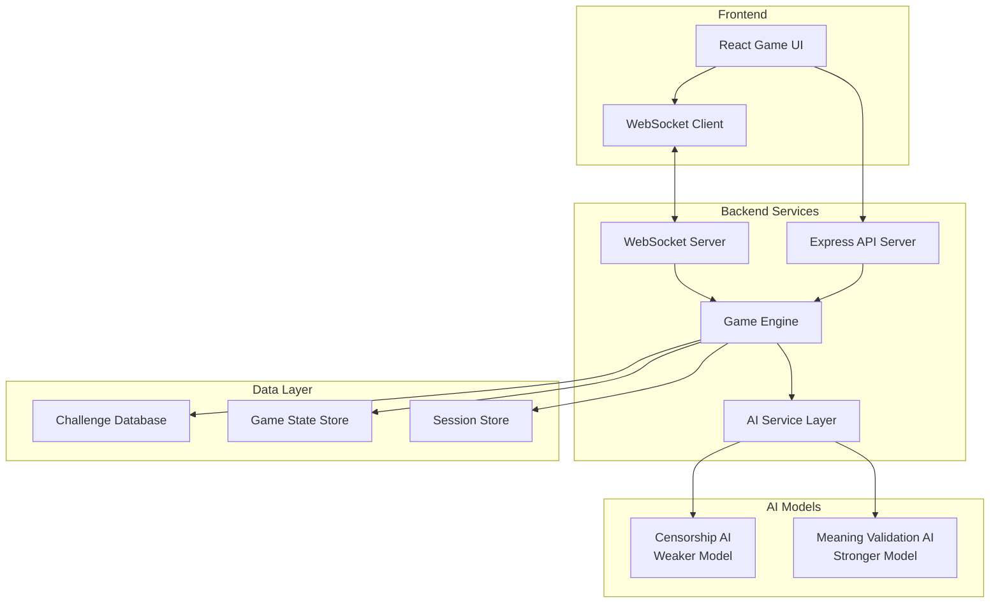

# Design Document

## Overview

The Koalang Censorship Game is a real-time multiplayer web application that implements a communication game where players attempt to convey hidden messages using creative language while avoiding AI-powered censorship detection. The system consists of a Node.js backend with WebSocket support for real-time communication, AI service integrations for censorship detection and meaning validation, and a React-based frontend for the game interface.

## Architecture

### High-Level Architecture



### Component Architecture

The system follows a modular architecture with clear separation of concerns:

- **Frontend Layer**: React-based SPA with real-time WebSocket communication
- **API Layer**: RESTful endpoints for game management and administration
- **Game Engine**: Core game logic, state management, and rule enforcement
- **AI Service Layer**: Abstraction for AI model interactions with fallback handling
- **Data Layer**: Persistent storage for challenges and temporary storage for game state

## Components and Interfaces

### Frontend Components

#### GameLobby Component
- **Purpose**: Handle game room creation, joining, and player management
- **Props**: `gameId`, `playerId`, `onGameStart`
- **State**: `players[]`, `gameSettings`, `isHost`
- **WebSocket Events**: `player-joined`, `player-left`, `game-started`

#### WordsmithView Component
- **Purpose**: Display challenge details and message input for the Wordsmith
- **Props**: `challenge`, `onMessageSend`, `timeRemaining`
- **State**: `messageHistory[]`, `currentMessage`, `isCaught`
- **Features**: Challenge display (hidden message, theme, setting, example), message composition area

#### GuesserView Component
- **Purpose**: Display messages and interpretation input for Guessers
- **Props**: `messages[]`, `theme`, `setting`, `onGuessSubmit`
- **State**: `currentGuess`, `hasGuessedCorrectly`, `interpretationHistory[]`
- **Features**: Message timeline, guess submission, waiting state after correct guess

#### GameBoard Component
- **Purpose**: Main game interface coordinating all views
- **Props**: `gameState`, `currentPlayer`
- **State**: `currentView`, `gamePhase`
- **Features**: Role-based view switching, real-time updates, score display

### Backend Services

#### Game Engine (`/src/services/GameEngine.js`)

```javascript
class GameEngine {
  constructor(gameId, settings) {
    this.gameId = gameId;
    this.settings = settings;
    this.state = new GameState();
    this.aiService = new AIService();
  }

  async startRound(wordsmithId) {
    // Select random challenge based on difficulty filter
    // Assign Wordsmith role
    // Start round timer
    // Emit game state update
  }

  async processWordsmithMessage(playerId, message) {
    // Validate player is current Wordsmith
    // Add message to round history
    // Process through censorship AI
    // Handle censorship detection or broadcast message
    // Update game state
  }

  async processGuesserInterpretation(playerId, interpretation) {
    // Validate player is Guesser and hasn't guessed correctly
    // Process through meaning validation AI
    // Award points if correct
    // Update player state
    // Check round completion conditions
  }
}
```

#### AI Service Layer (`/src/services/AIService.js`)

```javascript
class AIService {
  constructor() {
    this.censorshipModel = new WeakAIModel(); // e.g., GPT-3.5-turbo
    this.validationModel = new StrongAIModel(); // e.g., GPT-4
  }

  async detectCensorship(messages, hiddenMessage) {
    // Combine all messages from round
    // Send to censorship AI with context
    // Return { detected: boolean, confidence: number, guess: string }
  }

  async validateMeaning(interpretation, hiddenMessage, context) {
    // Send interpretation and hidden message to validation AI
    // Return { isMatch: boolean, confidence: number, reasoning: string }
  }
}
```

#### WebSocket Server (`/src/services/WebSocketServer.js`)

```javascript
class WebSocketServer {
  constructor(server) {
    this.io = socketio(server);
    this.gameRooms = new Map();
  }

  handleConnection(socket) {
    // Player joins game room
    // Handle message sending
    // Handle guess submissions
    // Handle disconnections
    // Broadcast game state updates
  }
}
```

### Data Models

#### Challenge Model
```javascript
{
  round: Number,
  difficulty: String, // "Easy", "Medium", "Hard", "Very Hard"
  hidden: String,     // The actual message to convey
  theme: String,      // Thematic context
  setting: String,    // Environmental context
  example: String     // Example Koalang message
}
```

#### Game State Model
```javascript
{
  gameId: String,
  phase: String,      // "lobby", "playing", "ended"
  currentRound: Number,
  wordsmithId: String,
  challenge: Challenge,
  messages: Message[],
  players: Player[],
  scores: Map<String, Number>,
  settings: GameSettings,
  roundTimer: Number,
  roundStartTime: Date
}
```

#### Player Model
```javascript
{
  id: String,
  name: String,
  role: String,       // "wordsmith", "guesser"
  score: Number,
  hasGuessedCorrectly: Boolean,
  isConnected: Boolean,
  lastActivity: Date
}
```

## Data Models

### Challenge Storage
Challenges are stored in a JSON file or lightweight database with the following structure:

```json
{
  "challenges": [
    {
      "round": 1,
      "difficulty": "Easy",
      "hidden": "Datadog's dashboards are unreliable lately.",
      "theme": "Medieval town gossip.",
      "setting": "Lunchtime at a crepe stand in the \"old quarter\" of a fantasy town built in Minecraft during a weekend team jam.",
      "example": "This morning the watchtower's bell rang thrice, but the sound drowned under the clatter of copper pots in the square..."
    }
  ]
}
```

### Game State Management
Game state is maintained in memory with Redis backup for persistence across server restarts. The state includes:

- Active game sessions
- Player connections and roles
- Round progress and timers
- Message history and AI responses
- Score tracking

### Session Management
Player sessions are managed using JWT tokens with the following claims:
- `playerId`: Unique player identifier
- `gameId`: Current game session
- `playerName`: Display name
- `exp`: Token expiration

## Error Handling

### AI Service Failures
- **Censorship AI Timeout**: Default to "not detected" to keep game flowing
- **Validation AI Timeout**: Default to "no match" with manual review option
- **Model Unavailable**: Fallback to simpler rule-based detection
- **Rate Limiting**: Queue requests with exponential backoff

### Network Issues
- **WebSocket Disconnection**: Automatic reconnection with state recovery
- **Message Loss**: Message acknowledgment system with retry logic
- **Player Dropout**: Graceful handling with game continuation

### Game State Corruption
- **Invalid State Transitions**: Validation with rollback to last known good state
- **Concurrent Modifications**: Optimistic locking with conflict resolution
- **Data Inconsistency**: Regular state validation with automatic correction

## Testing Strategy

### Unit Testing
- **Game Engine Logic**: Test round management, scoring, and state transitions
- **AI Service Integration**: Mock AI responses for consistent testing
- **Data Models**: Validate challenge structure and game state integrity
- **WebSocket Handlers**: Test message routing and error handling

### Integration Testing
- **End-to-End Game Flow**: Simulate complete game sessions with multiple players
- **AI Model Integration**: Test with actual AI services using test challenges
- **Real-time Communication**: Verify WebSocket message delivery and ordering
- **Database Operations**: Test challenge loading and game state persistence

### Performance Testing
- **Concurrent Games**: Test multiple simultaneous game sessions
- **AI Response Times**: Measure and optimize AI service call latency
- **WebSocket Scalability**: Test with maximum player counts per game
- **Memory Usage**: Monitor game state memory consumption over time

### User Acceptance Testing
- **Gameplay Balance**: Verify AI difficulty levels provide appropriate challenge
- **User Experience**: Test interface responsiveness and clarity
- **Edge Cases**: Test unusual player behaviors and network conditions
- **Accessibility**: Ensure game is playable with assistive technologies

## Security Considerations

### Input Validation
- Sanitize all player messages and names
- Validate challenge data structure and content
- Rate limit message submission to prevent spam

### Authentication & Authorization
- Secure game room access with unique IDs
- Validate player permissions for actions (Wordsmith vs Guesser)
- Prevent unauthorized access to challenge answers

### AI Safety
- Content filtering for inappropriate messages
- Monitoring for attempts to exploit AI models
- Logging of all AI interactions for review

## Performance Optimization

### Caching Strategy
- Cache frequently accessed challenges in memory
- Use Redis for game state with TTL for cleanup
- Implement challenge preloading for faster game starts

### AI Optimization
- Batch AI requests when possible
- Implement request queuing to manage rate limits
- Use streaming responses for faster feedback

### Real-time Updates
- Optimize WebSocket message size and frequency
- Implement selective updates to reduce bandwidth
- Use compression for large game state updates